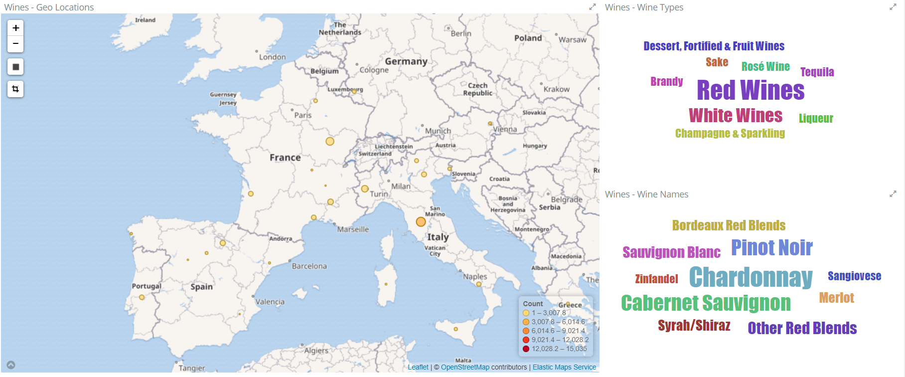
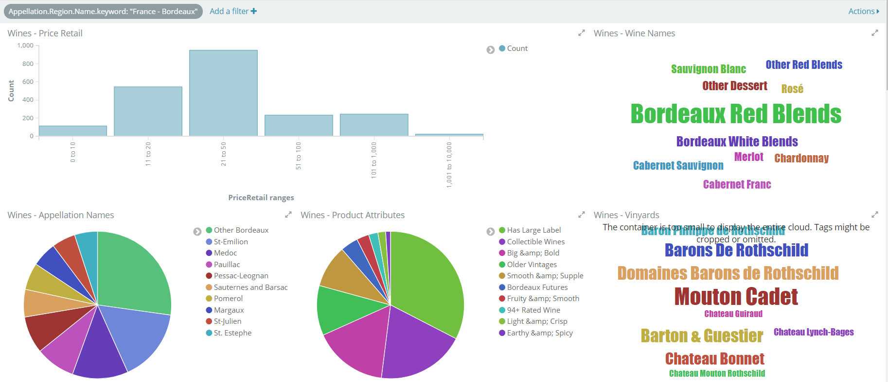
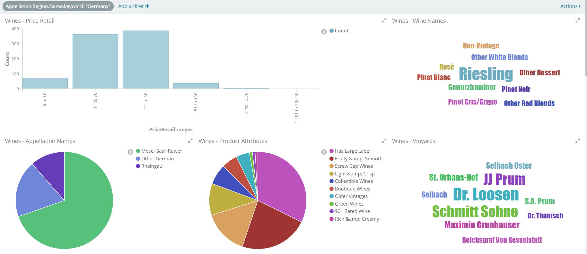
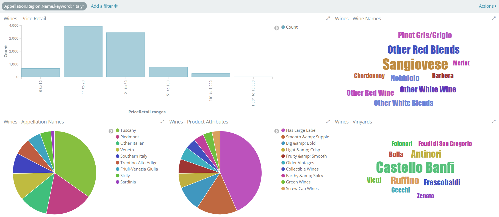

# pywine

[Crawl](crawler.py) the wine catalogue from wine.com and ingest it in an elastic index. 
The geo location is inferred using the [google geo decorator](decorator/google_geolocation_decorator.py) 

The pictures below display wine on sale at wine.com. 

# Requirements/Setup:

## Data
* API key from [wine.com](https://api.wine.com)

## Storage
* [elasticsearch 5.5.0](https://www.elastic.co/de/downloads/elasticsearch), or a higher version

## Visualization
* [kibana 5.5.0](https://www.elastic.co/de/downloads/kibana), or a higher version

# TODOs and other relevant data source
* write some fancy documentation
* [Captain Cork](http://www.captaincork.com/entdecken)